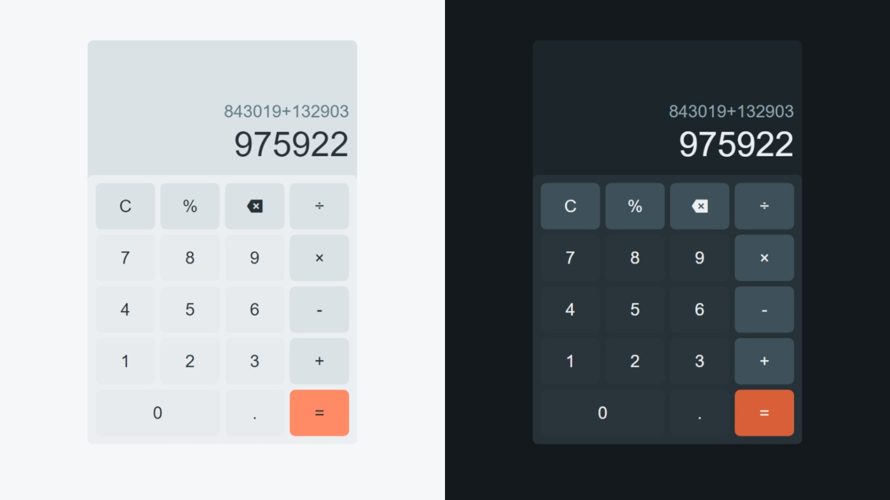

# Calculator (HTML,CSS,JavaScript)

This calculator has been developed using HTML, CSS, and Vanilla JavaScript. You can use it just like a normal calculator. It allows input by clicking on the user interface or pressing numbers and symbols on your keyboard. Additionally, it offers the flexibility to switch between light mode and dark mode.

## Preview

## Credit
Icon: [Remix Icon](https://remixicon.com/)
